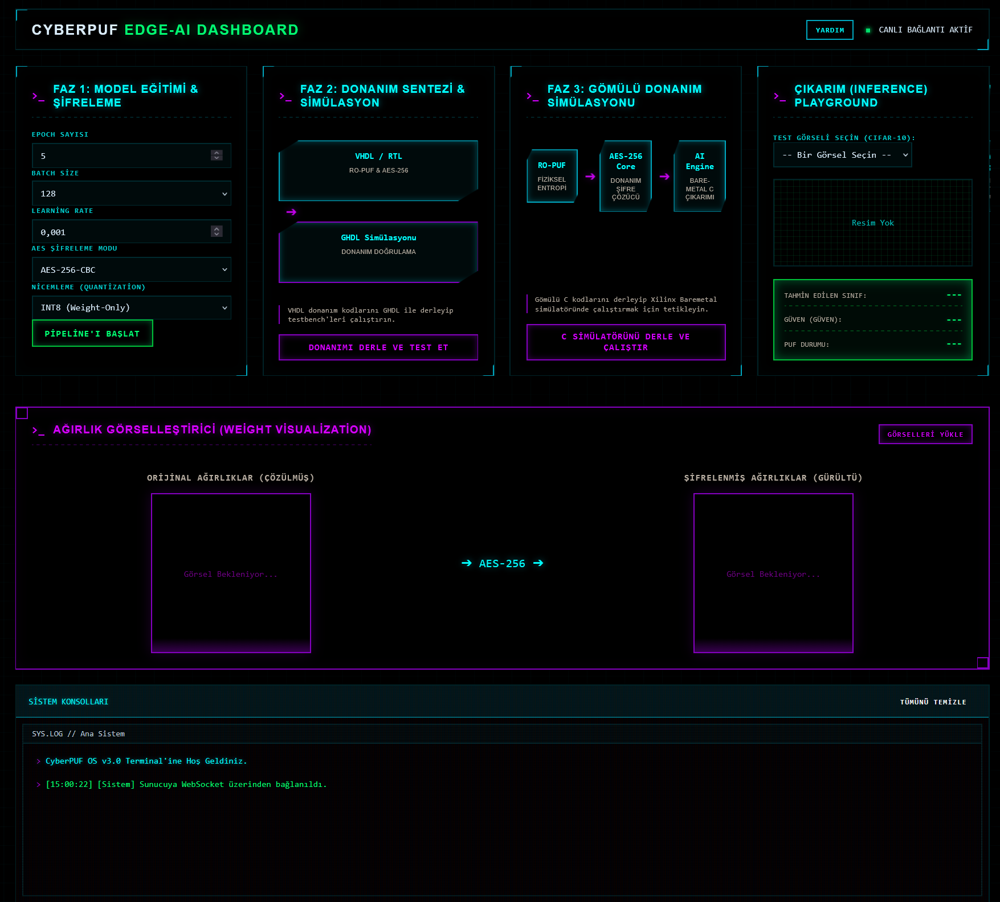

# CyberPUF: PUF Tabanlı Uç Yapay Zeka (Edge-AI) Model Ağırlığı Şifrelemesi


[Türkçe](#turkce) | [English](#english)

---

<a name="turkce"></a>
## Türkçe

**Geliştirici:** Arda Meçik (AltaySec bünyesinde geliştirilmiştir)
**Sürüm:** v3.1.0-Web (Web Dashboard & Arayüz Entegrasyonu)
**Lisans:** MIT

### 🚀 Hızlı Başlangıç (Quick Start)

#### Kurulum (Installation)

```bash
# Bağımlılıkları yükle
pip install -r requirements.txt

# Environment dosyasını oluştur
cp .env.example .env

# .env dosyasını düzenle (güvenli token oluştur)
# Linux/Mac:
nano .env
# Windows:
# Not: .env dosyasında CYBERPUF_AES_KEY ve WEBSOCKET_TOKEN'ı güvenli değerlerle doldur
```

#### Çalıştırma (Running)

```bash
# Windows:
python main_app.py

# Veya:
python -m uvicorn main_app:app --host 127.0.0.1 --port 8000 --reload

# Tarayıcıda açın:
# http://127.0.0.1:8000
```

---

CyberPUF, uç cihazlarda (FPGA ve SoC mimarileri gibi) konuşlandırılan yapay sinir ağı ağırlıklarının fikri mülkiyetini (IP) korumak için tasarlanmış gelişmiş bir Donanım Güvenliği ve Gömülü Yapay Zeka projesidir. Model ağırlıklarının harici flash/RAM'de şifrelenmiş olarak saklanmasını ve yalnızca çalışma zamanında, silikon sınırları içinde Ring Oscillator Fiziksel Klonlanamaz Fonksiyonu (RO-PUF) tarafından üretilen donanıma özgü bir anahtar kullanılarak deşifre edilmesini sağlar.

### 🖥️ CyberPUF Web Dashboard (Yeni!)

Sistemin uçtan uca kontrolü ve görselleştirilmesi için geliştirilmiş modern, asenkron ve siberpunk temalı web arayüzü:
- **Dinamik Görev Konsolları:** Her işlem (Eğitim, Donanım Sentezi, Simülasyon) için dinamik olarak açılan ve kapatılabilen yan yana WebSocket konsolları.
- **Canlı Sistem Logları:** `asyncio.gather` destekli, darboğazsız asenkron WebSocket yayını.
- **Güvenlik Mimarisi:** API Rotalarında Statik Bearer tabanlı kimlik doğrulama, `hmac.compare_digest` ile Zamanlama Saldırısı (Timing Attack) koruması, CSRF denetimleri ve tam izolasyon.
- **Gizlilik:** Loglarda kullanıcının bilgisayarındaki asıl dosya yollarının maskelenmesi (Path Masking).
- **Ağırlık Görselleştirici (Weight Viz):** Şifrelenmiş anlamsız ağırlıkların, şifrelenmeden önceki (çözülmüş) haliyle arasındaki farkın piksel piksel ekranda gösterilmesi.

### Teknik Mimari

Proje, Yazılım Yapay Zekası, Donanım Kriptografisi ve Gömülü Sistemleri (Bare-Metal) birbirine bağlayan üç aşamalı bir yapıdan ve bu yapıyı orkestre eden Web Dashboard'dan oluşur:

#### Faz 1: Yapay Zeka Eğitimi ve Şifreleme (Python)
- **Model Eğitimi:** CIFAR-10 veri seti üzerinde TensorFlow/Keras kullanılarak Evrişimli Sinir Ağı (CNN) eğitilir.
- **CPUF Format Dönüşümü:** Ağırlıklar ve bias'lar `.h5` dosyasından çıkarılır ve dinamik meta veriler ile ham `float32` tensörlerini içeren özel bir ikili formata (`.cpuf`) dönüştürülür.
- **AES-256-CBC & SHA-256 Şifreleme:** `pycryptodome` kütüphanesi kullanılarak `.cpuf` dosyası PKCS7 dolgusu ile AES-256-CBC modunda şifrelenir. Güvenlik bütünlüğü (Tamper Detection) için ağırlıkların donanım öncesi `SHA-256` özeti hesaplanarak başlığa (header) dinamik olarak eklenir. `CYBERPUF_AES_KEY` ortam değişkeni fail-fast güvenlik kalkanıyla korunur.
- **KDF ve HMAC:** PBKDF2-HMAC-SHA256 ile anahtar türetme veya doğrudan (Direct) HMAC modları ile esnek kriptografik bütünlük sağlar.
- **Doğrulama:** Şifreleme sürecinin bütünlüğünü ve kurcalama korumasını test eden uçtan uca Python doğrulama betiği.

#### Faz 2: Donanım Güvenliği ve Kriptografi (VHDL)
- **Ring Oscillator PUF (RO-PUF):** 16 çift (toplam 32) Ring Oscillator ile inşa edilen özel bir fiziksel klonlanamaz fonksiyon. Üretim varyasyonlarını kullanarak eşsiz bir 256-bit anahtar üretir.
- **Anahtar Üretimi:** Ortam gürültüsünü ortadan kaldırmak için bit başına 16 kez PUF salınımlarını örnekleyen çoğunluk oylaması (majority-voting) mekanizması.
- **AES-256 Çözümleme Motoru:** FIPS-197 uyumlu, tam donanımlı AES çözümleme boru hattı (pipeline).
- **Yan Kanal Saldırı Koruması (SCA Countermeasures):** AES şifre çözme modülüne entegre edilmiş LFSR tabanlı yapay güç gürültüsü üreteci ve rastgele gecikme (Random Stall) enjeksiyonu. Güç Analizi (DPA/CPA) ve Elektromanyetik (EMA) saldırılarına karşı koruma önlemleri simüle edilmiştir.
- **AXI4-Lite Wrapper:** İşlemci Sistemi (ARM Cortex-A) ile haberleşmeyi sağlamak için tüm kriptografi çekirdeğinin 20 farklı bellek eşlemeli (memory-mapped) yazmaç ile (0x00 - 0x4C) AXI4-Lite arayüzüne sarılması.

#### Faz 3: Gömülü Yapay Zeka Çıkarımı (C/C++ Bare-Metal)
- **Donanım Soyutlama Katmanı (HAL):** Memory-mapped I/O üzerinden VHDL modüllerini kontrol eden, PUF üretimini tetikleyen ve AES motoruna 16-byte'lık şifreli bloklar besleyen özel C sürücüleri (`cyberpuf_dsk.c`). Yazılım tarafında AES-CBC XOR zincirlemesini yönetir.
- **SHA-256 Bütünlük Testi:** Bare-metal uyumlu C tabanlı `sha256.c` entegrasyonu. Çözülen modelin özeti hesaplanıp header'daki orijinal özet ile eşleştirilmezse donanım Panic Mode'a geçerek belleği güvenle imha eder (Secure Wipe).
- **Yardımcı Veri Üretici (Fuzzy Extractor):** PUF anahtarındaki sıcaklık/voltaj kaynaklı bit hatalarını (gürültüyü) silikon dışında Code-Offset ve Hamming(7,4) Hata Düzeltme Kodları (ECC) ile teorik hata düzeltme kapasitesi sunarak onaran akıllı hata ayıklama modülü (`yardimci_veri_uretici.c`). Global Timer üzerinden (XTime_GetTime) tam rastgele tohumlanır.
- **Bare-Metal CNN Motoru:** Hiçbir harici kütüphane kullanılmadan C dilinde sıfırdan yazılmış yapay zeka çıkarım motoru. RAM parçalanmasını en aza indirmek için ping-pong bellek tekniği kullanarak Conv2D (Cache-friendly Loop), MaxPool, Dense ve BatchNorm+ReLU katmanlarını destekler.

#### Kriptografik Bütünlük ve HMAC/KDF Seçenekleri
Sistem, şifrelenmiş model ağırlıklarının bütünlüğünü (Integrity) ve kurcalama korumasını (Tamper Resistance) doğrulamak için iki farklı mod sunar:
1. **Doğrudan (Direct) HMAC Modu:**
   - **Çalışma Prensibi:** RO-PUF'tan üretilen donanım anahtarı, şifreli verilerin bütünlüğünü denetlemek için doğrudan HMAC-SHA256 anahtarı olarak kullanılır.
   - **Avantajı:** Bare-metal gömülü tarafta (C) neredeyse sıfır gecikme (latency) ile çalışır ve son derece yüksek performans sağlar.
   - **Kullanım Senaryosu:** İşlem gücü ve kaynakları çok sınırlı olan gömülü uç cihazlar.
2. **PBKDF2-HMAC Modu:**
   - **Çalışma Prensibi:** Donanım anahtarı, 600,000 iterasyonluk PBKDF2-HMAC-SHA256 esnetme işleminden geçirilerek türetilmiş bir HMAC anahtarı üretilir.
   - **Avantajı:** Çok yüksek kriptografik direnç sağlar ve ham PUF anahtarının doğrudan kullanımını engeller.
   - **Sınırlama:** Donanım ivmelendirici bulunmayan bare-metal işlemcilerde PBKDF2 işlemini yazılımsal olarak koşturmak çok uzun zaman aldığından, gömülü C simülasyonunda bu mod algılandığında güvenlik uyarısı verilerek doğrulama aşaması bypass edilir.

### Test Sonuçları (Donanım AES-256 Crypto Core)
GHDL simülasyonu ile donanımın şifre çözme performansı ve doğruluğu başarıyla test edilmiştir. Aşağıda VHDL Testbench'inin doğrudan çıktısı bulunmaktadır:

```text
========================================
TEST 1: NIST AES-256 Key Expansion
========================================
Key expansion tamamlandi.

========================================
TEST 2: AES-256 Encryption
========================================
Plaintext  : 00112233445566778899aabbccddeeff
Ciphertext : 8EA2B7CA516745BFEAFC49904B496089
Expected   : 8ea2b7ca516745bfeafc49904b496089
TEST 2 BASARILI: Encryption dogru!

========================================
TEST 3: AES-256 Decryption (Sifre Cozme)
========================================
Ciphertext  : 8EA2B7CA516745BFEAFC49904B496089
Decrypted   : 00112233445566778899AABBCCDDEEFF
Expected PT : 00112233445566778899aabbccddeeff
TEST 3 BASARILI: Decryption dogru!

========================================
TEST 4: Encrypt-then-Decrypt Round Trip
========================================
Orijinal PT : DEADBEEFCAFEBABE1234567890ABCDEF
Encrypted   : F15CFE4C4CBC4D547A96C9CCC8BC3F38
Decrypted   : DEADBEEFCAFEBABE1234567890ABCDEF
TEST 4 BASARILI: Round-trip dogru!

========================================
TEST 5: Farkli Anahtar ile Sifreleme
========================================
Key         : 603DEB1015CA71BE2B73AEF0857D77811F352C073B6108D72D9810A30914DFF4
Plaintext   : 6BC1BEE22E409F96E93D7E117393172A
Encrypted   : F3EED1BDB5D2A03C064B5A7E3DB181F8
Decrypted   : 6BC1BEE22E409F96E93D7E117393172A
TEST 5 BASARILI: Farkli anahtar round-trip dogru!

========================================
GENEL SONUC
========================================
TUM TESTLER BASARILI!
Simulasyon tamamlandi.
```

### Kullanılan Diller ve Teknolojiler
* **Yazılım ve Yapay Zeka:** Python 3.10+, TensorFlow / Keras, NumPy, PyCryptodome
* **Donanım Tasarımı (HDL):** VHDL-2008, GHDL / TerosHDL, Xilinx Vivado (Sentez, XDC Kısıtlamaları)
* **Gömülü Sistemler:** C / C++ (Bare-metal), Xilinx Vitis / GCC, AXI4-Lite Protokolü

### Başlangıç Kılavuzu
**1. Projeyi İndirme**
```bash
git clone https://github.com/mecik-arda/CyberPUF.git
cd CyberPUF
```

**2. Faz 1'i Çalıştırma (Yapay Zeka ve Şifreleme)**
Windows PowerShell için:
```powershell
pip install -r requirements.txt
$env:CYBERPUF_AES_KEY="0123456789abcdef0123456789abcdef"
python run_phase1.py 1 128 0.001 CBC
```

**3. Faz 2'yi Derleme (VHDL Donanımı)**
```powershell
cd donanim
.\compile.ps1
```

**4. Faz 3'ü Çalıştırma (Gömülü C Simülasyonu)**
```bash
cd gomulu
gcc src/main.c src/cyberpuf_dsk.c src/yapay_zeka_cikarimi.c src/yardimci_veri_uretici.c src/sha256.c -lm -o cyberpuf_sim.exe
./cyberpuf_sim.exe
```

---

<a name="english"></a>
## English

**Developer:** Arda Mecik (Developed at AltaySec)
**Version:** v3.1.0-Web (Web Dashboard Integration)
**License:** MIT

CyberPUF is an advanced Hardware Security and Embedded AI project designed to protect the intellectual property (IP) of neural network weights deployed on edge devices (like FPGAs and SoC architectures). It ensures that the model weights are encrypted while stored in external flash/RAM and are only decrypted at runtime within the silicon boundaries, using an intrinsic hardware key generated by a Ring Oscillator Physical Unclonable Function (RO-PUF).

### 🖥️ CyberPUF Web Dashboard (New!)

A modern, asynchronous, cyberpunk-themed web interface designed for end-to-end control and visualization of the system:
- **Dynamic Task Consoles:** Side-by-side, dismissible WebSocket consoles dynamically spawned for each pipeline stage (Training, Synthesis, Simulation).
- **Live System Logs:** Bottleneck-free asynchronous WebSocket broadcasting powered by `asyncio.gather`.
- **Security Architecture:** Static Bearer token-based authentication on API routes, Timing Attack protection using `hmac.compare_digest`, CSRF validation, and strict Content Security Policies.
- **Privacy Enforcement:** Intelligent absolute-path masking within terminal logs to prevent local directory leakage.
- **Weight Visualizer:** Real-time visual comparison engine that displays neural network weights before encryption (structured) and after encryption (random noise).

### Technical Architecture

The project is structured into three continuous phases that bridge Software AI, Hardware Cryptography, and Bare-Metal Embedded Systems, all orchestrated by the Web Dashboard:

#### Phase 1: Software AI Training & Encryption (Python)
- **Model Training:** A Convolutional Neural Network (CNN) is trained on the CIFAR-10 dataset using TensorFlow/Keras. The architecture features Conv2D blocks with Batch Normalization and ReLU.
- **CPUF Format Serialization:** Weights and biases are extracted from the `.h5` file and serialized into a custom binary format (`.cpuf`), which includes dynamic metadata, magic numbers, and raw `float32` tensors.
- **AES-256-CBC & SHA-256 Encryption:** The `pycryptodome` library encrypts the `.cpuf` binary using AES-256 in CBC mode with PKCS7 Padding. To ensure tamper-resistance, a SHA-256 digest of the plaintext weights is dynamically appended to the header. Built-in `CYBERPUF_AES_KEY` environment variable enforcement blocks unauthorized execution.
- **KDF & HMAC:** Selectable cryptographic integrity via either a PBKDF2-HMAC-SHA256 key derivation function or a Direct HMAC mode.
- **Verification:** An end-to-end Python test suite ensures the integrity, decryption accuracy, and tamper-resistance of the encryption pipeline.

#### Phase 2: Hardware Security & Cryptography (VHDL)
- **Ring Oscillator PUF (RO-PUF):** A custom physical unclonable function built with 16 pairs of Ring Oscillators (32 total). It leverages silicon manufacturing variations to generate a unique, unpredictable 256-bit key. Includes `DONT_TOUCH` and combinatorial loop synthesis attributes to prevent logic optimization.
- **Key Generation:** A robust majority-voting mechanism samples the PUF oscillations 16 times per bit to eliminate environmental noise and temperature variations.
- **AES-256 Decryption Engine:** A full FIPS-197 compliant AES decryption pipeline with Inverse S-Boxes, Inverse ShiftRows, Inverse MixColumns (using GF(2^8) multipliers), and Key Expansion modules.
- **AXI4-Lite Wrapper:** The entire crypto-core is wrapped in an AXI4-Lite slave interface with 20 distinct memory-mapped registers (0x00 to 0x4C) for seamless communication with the Processing System (ARM Cortex-A).

#### Phase 3: Embedded AI Inference (C/C++ Bare-Metal)
- **Hardware Abstraction Layer (HAL):** Custom C drivers (`cyberpuf_dsk.c`) to control the VHDL IP via memory-mapped I/O, trigger PUF generation, and feed encrypted 16-byte blocks to the AES engine. Implements AES-CBC XOR chaining completely in software.
- **SHA-256 Integrity Verification:** Integrated a lightweight bare-metal `sha256.c` library. If the decrypted payload's digest does not match the header's expected digest, the system enters Panic Mode and securely wipes the memory.
- **Fuzzy Extractor (Helper Data Generator):** A smart error correction module (`yardimci_veri_uretici.c`) that provides theoretical error correction capacity for temperature/voltage-induced bit errors (noise) in the PUF key using Code-Offset and Hamming(7,4) Error Correction Codes (ECC). Fully randomized using Global Timer bounds (`XTime_GetTime`).
- **Bare-Metal CNN Engine:** A C-based AI inference engine written entirely from scratch without external libraries. It supports Conv2D (Cache-friendly), MaxPool, Dense, and Fused BatchNorm+ReLU layers, utilizing a ping-pong buffer technique to minimize RAM fragmentation.

#### Cryptographic Integrity & HMAC/KDF Options
The system supports two distinct verification modes to validate the integrity and ensure the tamper-resistance of the encrypted model weights:
1. **Direct HMAC Mode:**
   - **Mechanism:** The raw RO-PUF key is used directly as the HMAC-SHA256 key to verify the integrity of the ciphertext payload.
   - **Pros:** Near-zero overhead and execution latency on bare-metal microcontrollers (C).
   - **Best For:** Ultra-low-resource edge devices requiring fast boot times.
2. **PBKDF2-HMAC Mode:**
   - **Mechanism:** The raw key is stretched through 600,000 iterations of PBKDF2-HMAC-SHA256 to produce a hardened derived key.
   - **Pros:** High security margins, preventing any potential leak of the raw PUF key through side channels or oracle attacks.
   - **Limitations:** Running 600,000 PBKDF2 iterations in pure software on resource-constrained microcontrollers causes significant boot delay. In the bare-metal C simulation environment, detecting this mode triggers a warning log and bypasses the full iteration loop.

### Test Results (Hardware AES-256 Crypto Core)
The decryption accuracy and performance of the hardware have been successfully tested via GHDL simulation. Below is the direct output from the VHDL Testbench:

```text
========================================
TEST 1: NIST AES-256 Key Expansion
========================================
Key expansion tamamlandi.

========================================
TEST 2: AES-256 Encryption
========================================
Plaintext  : 00112233445566778899aabbccddeeff
Ciphertext : 8EA2B7CA516745BFEAFC49904B496089
Expected   : 8ea2b7ca516745bfeafc49904b496089
TEST 2 BASARILI: Encryption dogru!

========================================
TEST 3: AES-256 Decryption
========================================
Ciphertext  : 8EA2B7CA516745BFEAFC49904B496089
Decrypted   : 00112233445566778899AABBCCDDEEFF
Expected PT : 00112233445566778899aabbccddeeff
TEST 3 BASARILI: Decryption dogru!

========================================
TEST 4: Encrypt-then-Decrypt Round Trip
========================================
Orijinal PT : DEADBEEFCAFEBABE1234567890ABCDEF
Encrypted   : F15CFE4C4CBC4D547A96C9CCC8BC3F38
Decrypted   : DEADBEEFCAFEBABE1234567890ABCDEF
TEST 4 BASARILI: Round-trip dogru!

========================================
TEST 5: Farkli Anahtar ile Sifreleme
========================================
Key         : 603DEB1015CA71BE2B73AEF0857D77811F352C073B6108D72D9810A30914DFF4
Plaintext   : 6BC1BEE22E409F96E93D7E117393172A
Encrypted   : F3EED1BDB5D2A03C064B5A7E3DB181F8
Decrypted   : 6BC1BEE22E409F96E93D7E117393172A
TEST 5 BASARILI: Farkli anahtar round-trip dogru!

========================================
GENEL SONUC
========================================
TUM TESTLER BASARILI!
Simulasyon tamamlandi.
```

### Languages & Technologies Used
* **Software & AI:** Python 3.10+, TensorFlow / Keras, NumPy, PyCryptodome
* **Hardware Design (HDL):** VHDL-2008, GHDL / TerosHDL, Xilinx Vivado (Synthesis, Implementation, XDC)
* **Embedded Systems:** C / C++ (Bare-metal), Xilinx Vitis / GCC, AXI4-Lite Protocol

### Directory Structure
```text
CyberPUF/
├── ai_sifreleme/                  # Python AI & Crypto Tools
│   ├── train_model.py             # Trains the CNN model
│   ├── export_weights.py          # Creates the .cpuf binary
│   ├── encrypt_weights.py         # Encrypts CPUF to .cpfe / .h
│   └── verify_encryption.py       # Validates the encryption
├── donanim/                       # VHDL Hardware Design
│   ├── vhdl/                      # PUF, AES, and AXI source codes
│   ├── testbench/                 # VHDL Simulation Testbenches
│   └── constraints/               # Xilinx XDC constraints files
├── gomulu/                        # Bare-Metal C Application
│   ├── src/                       # HAL, AI Inference, and main program
│   │   └── sha256.c               # Cryptographic SHA-256 implementation
├── static/                        # Web Dashboard Frontend assets (HTML, CSS, JS, Favicon)
├── main_app.py                    # Web Dashboard Backend server (FastAPI, WebSockets)
├── run_phase1.py                  # Python Automation Orchestrator
├── requirements.txt               # Python Dependencies
├── .gitignore                     # Git ignore rules
└── LICENSE                        # MIT License
```

### Getting Started
**1. Downloading the Project**
```bash
git clone https://github.com/mecik-arda/CyberPUF.git
cd CyberPUF
```

**2. Running Phase 1 (AI Training & Encryption)**
For Windows PowerShell:
```powershell
pip install -r requirements.txt
$env:CYBERPUF_AES_KEY="0123456789abcdef0123456789abcdef"
python run_phase1.py 1 128 0.001 CBC
```

**3. Compiling Phase 2 (VHDL Hardware)**
```powershell
cd donanim
.\compile.ps1
```

**4. Running Phase 3 (Embedded C Simulation)**
```bash
cd gomulu
gcc src/main.c src/cyberpuf_dsk.c src/yapay_zeka_cikarimi.c src/yardimci_veri_uretici.c src/sha256.c -lm -o cyberpuf_sim.exe
./cyberpuf_sim.exe
```

**5. Running the Web Dashboard (New)**
```bash
# Set up environments as described in Hızlı Başlangıç
# Then start the dashboard server:
python main_app.py
# Open your browser and navigate to http://127.0.0.1:8000
```

